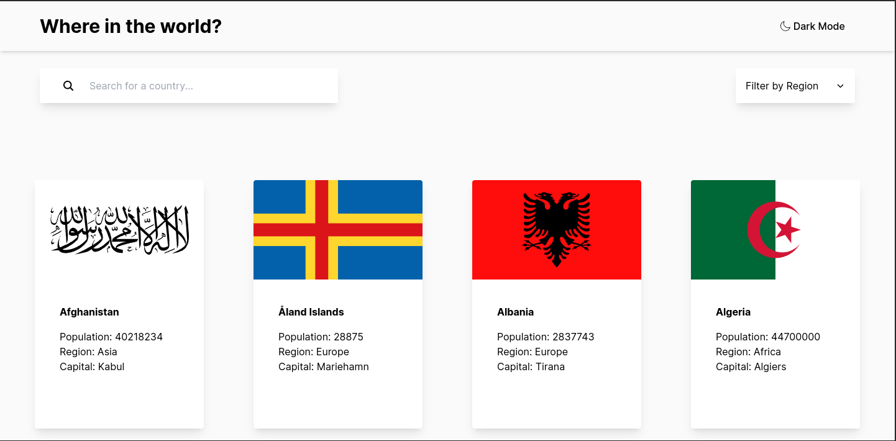

# Frontend Mentor - REST Countries API with color theme switcher solution

This is a solution to the
[REST Countries API with color theme switcher challenge on Frontend Mentor](https://www.frontendmentor.io/challenges/rest-countries-api-with-color-theme-switcher-5cacc469fec04111f7b848ca).
Frontend Mentor challenges help you improve your coding skills by building realistic projects.

## Table of contents

-   [Overview](#overview)
    -   [The challenge](#the-challenge)
    -   [Screenshot](#screenshot)
    -   [Links](#links)
-   [My process](#my-process)
    -   [Built with](#built-with)
    -   [What I learned](#what-i-learned)
    -   [Continued development](#continued-development)
    -   [Useful resources](#useful-resources)
-   [Author](#author)

## Overview

### The challenge

Users should be able to:

-   See all countries from the API on the homepage
-   Search for a country using an `input` field
-   Filter countries by region
-   Click on a country to see more detailed information on a separate page
-   Click through to the border countries on the detail page
-   Toggle the color scheme between light and dark mode _(optional)_

### Screenshot



### Links

-   Live Site URL: [country-web-app](https://country-web-app.netlify.app/)

## My process

### Built with

-   [Next.js](https://nextjs.org/) - React framework
-   [Tailwind](https://tailwindui.com/) - For styles
-   [PnPm](https://pnpm.io/) - disk space efficient package manager
-   [Cypress](https://www.cypress.io/) - easily create tests for your modern web applications

### What I learned

-   How to implement tests on the front-end using Cypress
    -   Cypress end to end testing basics
    -   Cypress testing syntax

```
describe("My First Test", () => {
    beforeEach(() => { cy.visit("http://localhost:3000/"); });

    it("Finds a search bar", ()
    => { cy.get("input"); });
})
```

### Continued development

What I want to continue learning:

-   Adding different tests to my project

### Useful resources

-   [cypress.io/guides/end-to-end-testing/writing-your-first-end-to-end-test](https://docs.cypress.io/guides/end-to-end-testing/writing-your-first-end-to-end-test) -
    Helped me get started with end to end testing in cypress

## Author

-   Website - [Portfolio](https://carlosluevano.netlify.app/)
-   Frontend Mentor - [@Clue355](https://www.frontendmentor.io/profile/Clue355)
-   Twitter - [LinkedIn](https://www.linkedin.com/in/carlos-luevano/)
